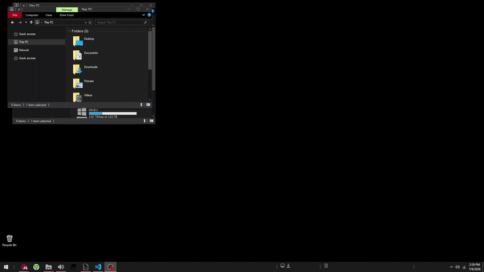

# FancierZones

A lightweight Windows window-management utility written in Python that lets you create custom screen zones, assign applications to them, and quickly tile windows using global mouse and keyboard shortcuts.

FancierZones was inspired by Microsoft PowerToys FancyZones, but is built around my own workflow and adds assignment-based automatic window placement and custom interaction behavior.

> **Status:** 🚧 Work in Progress

---

## Demo

## Features

### Visual Zone Editor

- Press F12 to open the zone editor.
- Create zones by clicking and dragging
- Move existing zones
- Resize zones from any edge or corner
- Snap zones to monitor edges
- Snap zones to neighboring zones while moving or resizing
- Multi-monitor support
- Automatically accounts for each monitor's Windows working area
- Delete selected zones
- Visual indication of zone assignments

### Window Tiling

- Quickly move windows into the best available zone using global shortcuts.
- Win + Right Click — Tile the window under the cursor
- Win + Shift + Right Click — Tile multiple windows (Tile all open windows until zones are full)
- F11 — Apply configured window assignments (aka, tile all zones with manual assignments that are not "None/any")
- F12 — Toggle the zone editor

FancierZones tracks occupied zones and chooses available zones based on the current layout.

### Application Assignments

- Zones can be assigned to specific applications or windows using:
- Window title
- Executable name
- Window class

Assignments can be entered manually or selected using the built-in Pick Window tool.
The picker lets you select a running window and automatically retrieves its:

  - Title
  - Executable
  - Window Class

You can then choose which property FancierZones should use to identify that application.
Assigned applications can automatically move into their configured zones when matching windows are created.

### Zone Behavior
--work in progress

Zones support additional window behavior settings, including infrastructure for:

- Maximized window zones
- Always-on-top behavior
- Automatically tile applications on each application launch

Zones can also be expanded to match a monitor's Windows working area, allowing layouts to account for the taskbar and other reserved desktop space.

### System Tray
--work in progress

FancierZones runs as a lightweight background utility with a system tray menu.

Global settings such as automatic assignment behavior are stored in the application configuration and can be changed without modifying the zone layout.

### Planned

- Full Functioning GUI
- Settings/preferences menu
- Customizable hotkeys
- Drag-and-drop in zone editor
- More Window assignment rules
- Auto-layout restoration
- Multiple saved layouts
- Import / Export layouts
- Better System tray integration
- Improved multi / stacked monitor support

---

# How It Works

FancierZones uses native Windows APIs alongside Python to interact directly with desktop windows.

The application:
1. Detects all connected monitors and their working areas.
2. Loads saved zones and application assignments.
3. Installs low-level keyboard and mouse hooks.
4. Watches Windows window events.
5. Matches windows against configured assignments.
6. Moves matching windows into the appropriate zones.

The visual editor is built with Tkinter and maps the entire Windows virtual desktop into a single editing canvas, including monitors positioned at negative desktop coordinates.

## Motivation

After using Microsoft PowerToys FancyZones for years, I found myself wanting significantly more control over how windows behaved.

The original version of FancierZones was developed over several years as a 5,000+ line AutoHotkey project to automate my own workflow.

This repository is a complete redesign and modernization of that project using Python with a modular, maintainable architecture.

The goal isn't simply to recreate FancyZones—it's to build a more flexible workspace management tool that emphasizes customization, productivity, and extensibility.

---

## Technologies

- Python
- Tkinter
- PyWin32
- ctypes
- Win32 API
- Low-level keyboard and mouse hooks
- Windows event hooks
- Dataclasses and enums
- JSON configuration persistencePython
- Tkinter
- PyWin32
- ctypes
- Win32 API
- Low-level keyboard and mouse hooks
- Windows event hooks
- Dataclasses and enums
- JSON configuration persistence

---
## Installation

Clone the repository:

git clone <YOUR-GITHUB-REPOSITORY-URL>
cd FancierZones

Create and activate a virtual environment:

python -m venv .venv
.venv\Scripts\activate

Install the dependencies:

pip install -r requirements.txt

Run FancierZones:

python main.py

---

## Why I Built It

I previously built a custom window-management system in AutoHotkey and used it extensively as part of my own Windows workflow.

FancierZones is a ground-up Python implementation designed to turn that concept into a more structured application while giving me finer control over zone selection, automatic application placement, multi-monitor layouts, and Windows integration.

The project has also been an opportunity to work directly with Windows APIs, global input hooks, event-driven window monitoring, GUI development, persistent configuration, and increasingly complex application architecture.

Status

FancierZones is currently under active development.
Current work includes expanding per-zone window behaviors, improving the editor experience, and refining automatic application placement.

---
## License
MIT
